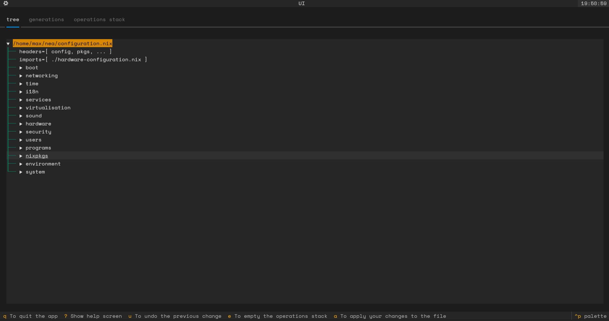
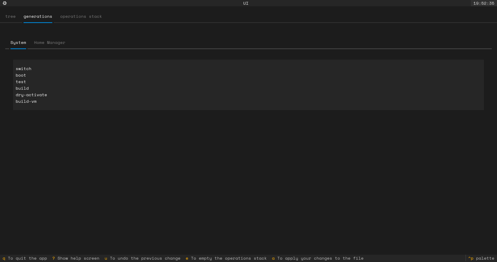
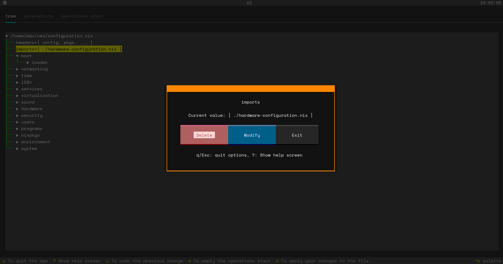
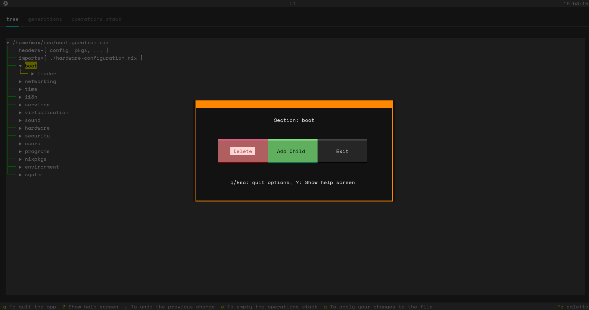

# Nix-tree
This is an optionated tool for viewing and editing your nix configuration as a tree

## RUN 🏃
* Note this tool currently is only tested for NixOS, so if you aren't on NixOS use it at your peril!

#### Enabling flakes ❄️
* To run this program you will need nix flakes enabled (or you can append the option for every command)
* So to enable nix flakes for just your user add this to your home-manager configuration:
```nix
nix = {
    package = pkgs.nix;
    settings.experimental-features = [ "nix-command" "flakes" ];
};
```
* Or to enable it system wide:
```nix
nix.settings.experimental-features = [ "nix-command" "flakes" ];
```
> [!NOTE]  
> Ensure you run the respective rebuild command after making these changes for them to take effect!

* Finally, if you just want to enable it on a command-by-command basis append `--experimental-features 'nix-command flakes'` to every command

#### Building and running the program 👷
* The program is wrapped in a flake, so it can be run with:
```nix
nix run 'github:max-amb/nix-tree' <your filename>
```
* There are two options which you can enable when running the program
    * `-w` which will enable writing over of the original file
    * `-c` which will enable comments being copied over

## Screenshots 📸
* The main screen displaying the tree:

* The screen for generation management:

* The screen you see when you select a variable:

* The screen you see when you select a section:


## FAQ ❓
* Q: Is there a tutorial/guide on how to use the program?
    * A: There is help screens on most of the screens which can be accessed by pressing ?.
* Q: How does it actually work?
    * A: I have some diagrams in the works currently which will be added in replacement of this answer!
* Q: Who is this aimed at?
    * A: This program is mostly aimed at users who are new to nix and would benifit from some guardrails when creating a configuration,
    however more experienced users still may find it useful for it's simplistic display of the configuration.
* Q: What does opinionated mean?
    * A: It means that the program will group all of the related sections together, for example if `services.openssh` and `services.xserver`
    were seperated in the original configuration, they will be both under `services` in the tree and in the outputted file.
* Q: Why is comments not on by default?
    * A: The program doesn't copy over all of the comments to the new file, comments that are not obviously attached to a line of code are not
    copied over. Hence, it is simpler to require the user to enable comment copying as it leads to less confusion.

## To be implemented in the future⏭️
- [x] More safety rails for the user, e.g. more pattern matching in inputs
    - I believe this is completed now but I am happy for any issues posted showing otherwise 
- [ ] Complete support of the basic Nix language
- [ ] The ability to analyse flakes (e.g.`in`statements)

## Limitations
This program obviously is not perfect, hence there are some limitations that should be taken into account by the user:
* The program cannot currently parse the `let in` combination or any flake for that matter
* ~~The syntax "..." = ..., often found in home manager is not supported~~ Now is after some more complex regex matching
* One example that doesn't work is code that has groups inside of sections, like `[ { ... } ]`, this will break the program for now
* ~~It may not be able to handle multiline strings often found in `extraConfig` options~~ The program can take them as input but has no way of displaying different lines or outputting different lines
* Comments done with `/* */` aren't stored for re-attachment as they are often inside clauses

## Credits
* The test configuration `./tests/example_configurations/pms_example_config.nix` comes from [here](https://perfectmediaserver.com/02-tech-stack/nixos/configuration.nix/)
* The test configuration `./tests/example_configurations/yasu_example_config.nix` comes from [here](https://discourse.nixos.org/t/configuration-nix-home-nix-examples/8185)
* The test configuration `./tests/example_configurations/shortened_default.nix` comes from the default nix configuration
